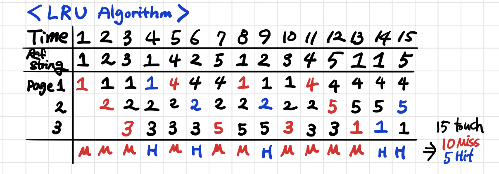
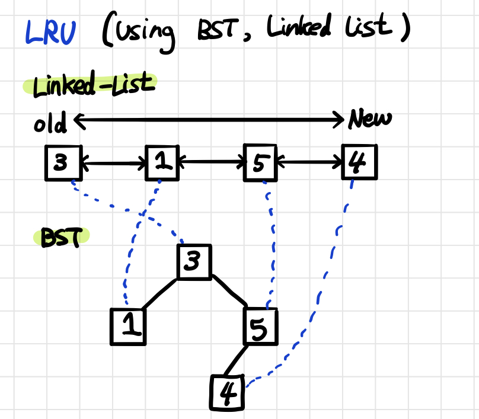
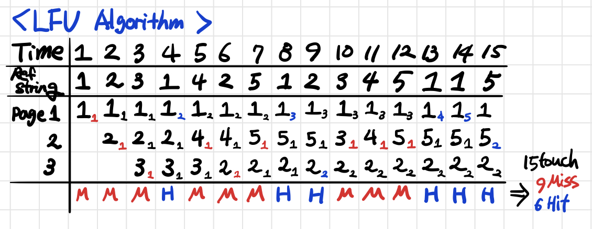
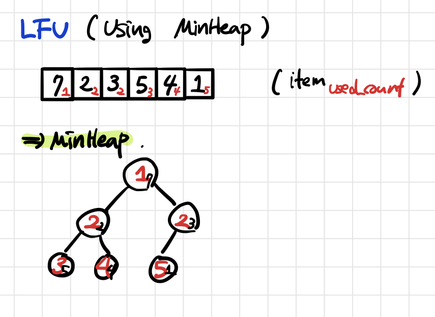

[TOC]

# Data Structure : Assignment 4 Report 

Name : **김소랑(Kim Solang, E-Mail : solangii@unist.ac.kr)**

Link : [Report](https://gitlab.com/unist_cse221_ds_spring_2020/uni20181041/-/blob/master/assignment4/Assignment-4-report-20181041.md), [MinHeap.h](https://gitlab.com/unist_cse221_ds_spring_2020/uni20181041/-/blob/master/assignment4/min_heap.h), [lfu.h](https://gitlab.com/unist_cse221_ds_spring_2020/uni20181041/-/blob/master/assignment4/lfu.h)

## 1. Code Description

### 1) MinHeap.h

```c++
template <typename T>
struct MinHeap{
		static int parent(int index); //my implement 1
  	static int child(int index); //my implement 2 
  	static void swap(T& a, T& b);//my implement 3
 		static void percolate_up(T* arr, int index); //my implement 4
    static void percolate_down(T* arr, int size, int index); //my implement 5
    static void heapify(T* arr, int size); //my implement 6
    static void make_heap(T* arr, int size, int hint = -1);//Build heap
    static void pop(T* arr, int size);//Delete minimum
    static void push(T*	arr, int size, T item);//Push item 
};
```

- `static int parent(int index);`  : return **parent index**
- `static int child(int index);` : return **child index**
- `static void swap(T& a, T& b);` : **swap** two value (using call by reference)
- `static void percolate_up(T* arr, int index);` : **percolate up algorithm** - It is an algorithm that sorts according to minheap rules from index to index 0. Starting comparision between parent and child value from input index, if the value at child index is smaller than his parent value, the swap is excuted because it violates minheap rules. This is repeated until index is replaced with parent index and root (index=0). If the minheap rule is followed during iteration(the child's value is lager than the parent's value), the loop will escape and be terminated early.
- `static void percolate_down(T* arr, int size, int index);` : **percolate down algorithm ** - It is an algorithm that sorts the input index to size-1 index a ccording to minheap rules. Find the smallest value after index and swap the value of index and the smallest value, and the child value of index will repeat it until all values follow minheap's rules. If the index reaches the last index, or if the values are correctly ordered, loop ends.
- `static void heapify(T* arr, int size);` : **heapify array** - Compare the values from the first index to size-1 index with values in the parent index. If there is a relationship that violates the minheap rules, reorder it through percolate up.
- `    static void make_heap(T* arr, int size, int hint = -1);` : **Build heap** - It is an algorithm heapify the entered array. If the hint exists in range(0~size-1), only the value in the hint index needs to be heapfy. So i can sort it using percolate algorithm. If hint is not given, use the heapify function to heapify.
- `static void pop(T* arr, int size);` : **Delete minimum** - Delete the smallest value in the heap(here is the value at index 0). It is difficult to apply concept of delete in an array already declared in size, so here is implemented in a way that is exchanged for the last value(the value at index size-1) and does not approach the size-1 index. Also, since the size of the value(at index 0) has changed, the minheap is reordered again from index 0 through percolate down.
- ` static void push(T*	arr, int size, T item);` : **Push item** - Push item to arr[size] Then, to consider the rules of minheap, run the percolate up(at that time index is size).(Also, I didn't consider the situation that push is excuted when the array is full.)

### 2) LFU.h

```c++
template <typename T>
struct CacheItem {
    int usedCount;
    T item;
  
    explicit CacheItem(T _item = T(), int _usedCount = 0);
    bool operator == (const CacheItem<T> &other);
    bool operator < (const CacheItem<T> &other);
    bool operator > (const CacheItem<T> &other);
};

template <typename T>
class LFU {
    CacheItem<T>** cache;
    const int size; 
    int misses;
    int cur_size; // added variable
    int hint_index; // added variable
  
public:
    LFU(int _size);//constructor
    ~LFU();//destructor 
  
    CacheItem<T>* find(T _item); // my implement
    bool exists(T item);
    int status() const;
    bool touch(T item);
    int getMisses();
};
```

- I add two variable `int cur_size`, `int hint_index` as class member variable. `cur_size` means the number of data in cache. Also, `hint_index` is used at `touch()` as hint index of `make_heap()`.
- `LFU()` : **Constructor**, initialization member variable and pointer.
- `~LFU()` :  **Destructor**, delete the pointer dynamic allocated.
- `CacheItem<T>* find(T _item)` : If you find _item in the cache array, **return the pointer on the CacheItem**. If there is no _item in the cache array, **return nullptr**
- `    bool exists(T item);`:  Return true if data exists in the cache, Return false otherwise **using `find()` function**.
- `    int status() const` : Return number of elements in cache **using member variable `cur_size`**
- `bool touch(T item)` : Return true on hit, false on miss. This function uses the `exists()` to check if the item exists in cache. If the item exists then check cache is full or not, and if the cache is full, delete the value that used to have a small number of access through `pop()` and insert a new value through `push`. (This is implemented through MinHeap.) If the cache is not full, just add a value through `push()`. If there exists an item in the cache already, add 1 more `used_count` of the corresponding `CacheItem` and reorder the heap.

## 2. Algorithm Description 

The amount of resources the cache uses is limited, and the cache must be able to store and access data quickly within limited resource. The **page replacement algorithm** is an algorithm **to determine which of the currently allocated pages should be replaced** to allocate new pages to maintain a certain amount of space in the cache. Examples of paging replacement algorithms are **Least Recently Used (LRU)** and**Least Frequency Used(LFU)**.

### 1) LRU(Least Recently Used)

The basic hypothesis of the LRU algorithm is **that data that has not been used for the longest time is less likely to be used in the future**. Based on this, it is an algorithm **to delete pages that have not been referenced for the longest time**.



#### Data Structure of LRU



The LRU algorithm can be implemented as **BST and Linked List**. The Linked List has a time complexity of O(1) for algorithms that reorder the data, but it takes O(n) to find the wanted data. On the other hand, BST, which are easy to find data, have less time complexity than linked list with O(log n). Using two advantages, data can be connected to each structure by a pointer to implement it.

### 2) LFU(Least Frequently Used)

The basic hypothesis of the LFU algorithm is **that the more frequently used data, the more likely it is to be used in the future**. Based on this, it is an algorithm that **deletes the page with the lowest number of references**.



#### Data Structure of LFU



The LFU algorithm can be implemented in **MinHeap**. First, create a structure `CacheItem` with data values(`item`) and the number of times used as variables(`used_count`). The datatype of MinHeap becomes this structure. Each time a particular data is referenced, the count of that data is increased by one. If **MinHeap is configured based on count, the fewer references, the more prioritized the Heap is**. Therefore, in situations where data needs to be deleted, **the value with the least number of references may be deleted**. The time complexity when deleting data is O(1) and the time complexity when pushing data is O(log n) because it is rearranged.


### 3) LRU vs. LFU

> #### **LRU**
>
> - Basic Hypothesis of LRU :  that data that has not been used for the longest time is less likely to be used in the future.
>
> - Focus on recording the order in which data is referenced. 
>
> - The LRU should check the time whenever a page call occurs. If a page change should occur, the time is the oldest, and the **disadvantage** of this method is that it is inefficient to find the oldest page and record it by changing the time on the page again each time a replacement occurs. In other words, **the need to record the time for the referenced page results in a large overhead**.

> #### **LFU**
>
> - Basic Hypothesis of LFU : that the more frequently used data, the more likely it is to be used in the future. 
> -  Focus on recording the frequency of use of data.
> - The LFU should check the frequency of used data. Overhead occurs because **it record the frequency of recently used data(page), even though there is a possibility of replacing them**. It is also a disadvantage that **data is deleted because it is recently used, even though it is about to be used**.


